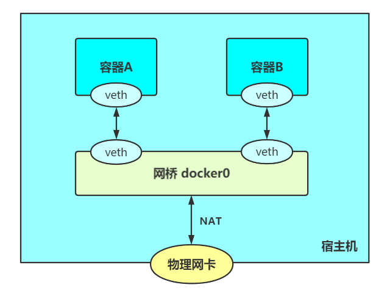

# zcontainer

使用C++实现的简易容器，主要学习容器技术原理，包括Linux系统提供的namespace,cgroups,iptables,等。

## 工具链

* C++14
* Clang16

* CMake

## 功能特性

支持运行容器，进入容器执行命令，容器网络。

```shell
zcontainer - a toy container runtime written in C++
Usage: ./bin/zcontainer_cli [OPTIONS] [SUBCOMMAND]

Options:
  -h,--help                   Print this help message and exit


Subcommands:
  run                         run a command in a new container
  exec                        exec a command in a running container
  network                     network management
```

### 运行容器
[Linux namespace笔记](./notes/Linux%20namespace学习.md)

[Linux cgroups笔记](./notes/Linux%20cgroups学习.md)

[镜像文件系统笔记](./notes/镜像文件系统.md)

1. **独立进程空间**

   容器进程加入新pid namespace，在该namespace中容器进程pid为1，重新挂载/proc文件系统保证ps命令正常工作。

2. **支持限制容器资源**

   使用Linux cgroups限制容器进程使用资源，支持限制内存资源，CPU使用率，CPU使用集合。

3. **独立镜像文件系统**

   使用pivot_root系统调用切换根文件系统，并使用overlay2文件系统进行联合挂载，镜像文件系统作为为只读层可以被多个容器共用，每个容器有自己的可写层进行修改。此外使用mount namespace保证挂载点隔离。

   本项目仅实现每个容器都使用busybox根文件系统。

### 进入容器
[exec命令实现笔记](./notes/exec命令实现.md)

**实现类似 docker exec命令进入指定容器内部执行命令**。

实际上加入容器进程namespace并执行命令即可。

* 环境变量需手动设置，`/proc/{container pid}/environ`文件中读取容器环境变量
* 使用`setns(int fd,int nstype)`可以加入文件描述符fd所表示的命名空间，`/proc/{container pid}/ns/`目录下存放容器命名空间文件，打开对应文件获取描述符。

加入后执行命令即可。

### 容器网络空间
[容器网络实现笔记](./notes/容器网络.md)

使用Linux网桥，veth设备，iptables实现了如图所示网络:


